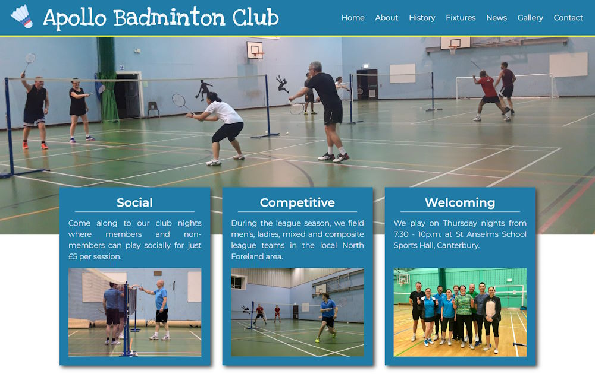

<a id="readme-top"></a>

<!-- PROJECT LOGO -->
<br />
<div align="center">
  <a href="https://github.com/emily83/apollo-badminton">
    
  </a>

<h3 align="center">Apollo Badminton Club</h3>

  <p align="center">
    Informational website for Apollo Badminton Club, Canterbury
    <br />
    <a href="https://github.com/emily83/apollo-badminton"><strong>Explore the docs »</strong></a>
    <br />
    <br />
    <a href="https://www.apollobadmintoncanterbury.co.uk/">View Website</a>
  </p>
</div>

<!-- TABLE OF CONTENTS -->
<details>
  <summary>Table of Contents</summary>
  <ol>
    <li>
      <a href="#about-the-project">About The Project</a>
      <ul>
        <li><a href="#built-with">Built With</a></li>
        <li><a href="#project-architecture">Project Architecture</a></li>
      </ul>
    </li>
    <li>
      <a href="#getting-started">Getting Started</a>
      <ul>
        <li><a href="#prerequisites">Prerequisites</a></li>
        <li><a href="#installation">Installation</a></li>
      </ul>
    </li>
    <li><a href="#usage">Usage</a></li>
    <li><a href="#contact">Contact</a></li>
  </ol>
</details>

<!-- ABOUT THE PROJECT -->

## About The Project

Apollo Badminton Club is a social badminton club in Canterbury, Kent. This repo contains the website which provides information about the club to members and visitors.



<p align="right">(<a href="#readme-top">back to top</a>)</p>

### Built With

The site is built using the JAMStack:-

SSG - Eleventy (https://www.11ty.dev/)
Templating - Nunjucks
CMS - Netlify CMS (https://decapcms.org/)

### Project Architecture

The site uses Eleventy as the Static Site Generator, with Nunjucks for templating. Markdown with front matter is used to hold the data for the site, e.g. the news articles.

The live website is deployed to Netlify which uses continuous deployment so any changes pushed to this GitHub repository will automatically be published.

Netlify CMS (now Decap CMS) is used as contact management for the live site. News articles, match fixtures and gallery images can be added here. The admin panel can be reached at https://www.apollobadmintoncanterbury.co.uk/admin. Users must be invited to register for the admin panel. When content is added here, a commit is added to the GitHub repository so it will be automatically published.

<p align="right">(<a href="#readme-top">back to top</a>)</p>

<!-- GETTING STARTED -->

## Getting Started

To get a local copy of the website up and running follow these steps.

### Prerequisites

You will need to have Node.js installed, and the latest version of npm.

- Get the latest version of npm
  ```sh
  npm install npm@latest -g
  ```

### Installation

1. Clone the repo
   ```sh
   git clone https://github.com/emily83/apollo-badminton.git
   ```
2. Change directory to the newly cloned repo
   ```sh
   cd apollo-badminton
   ```
3. Install NPM packages
   ```sh
   npm install
   ```

<p align="right">(<a href="#readme-top">back to top</a>)</p>

<!-- USAGE EXAMPLES -->

## Usage

To run the website in your development environment, you need to start the server

```sh
npm start
```

This will run the website at http://localhost:8080/

<p align="right">(<a href="#readme-top">back to top</a>)</p>

<!-- CONTACT -->

## Contact

Emily Couzens - emilycouzens@hotmail.co.uk

Project Link: [https://github.com/emily83/apollo-badminton](https://github.com/emily83/apollo-badminton)

<p align="right">(<a href="#readme-top">back to top</a>)</p>
